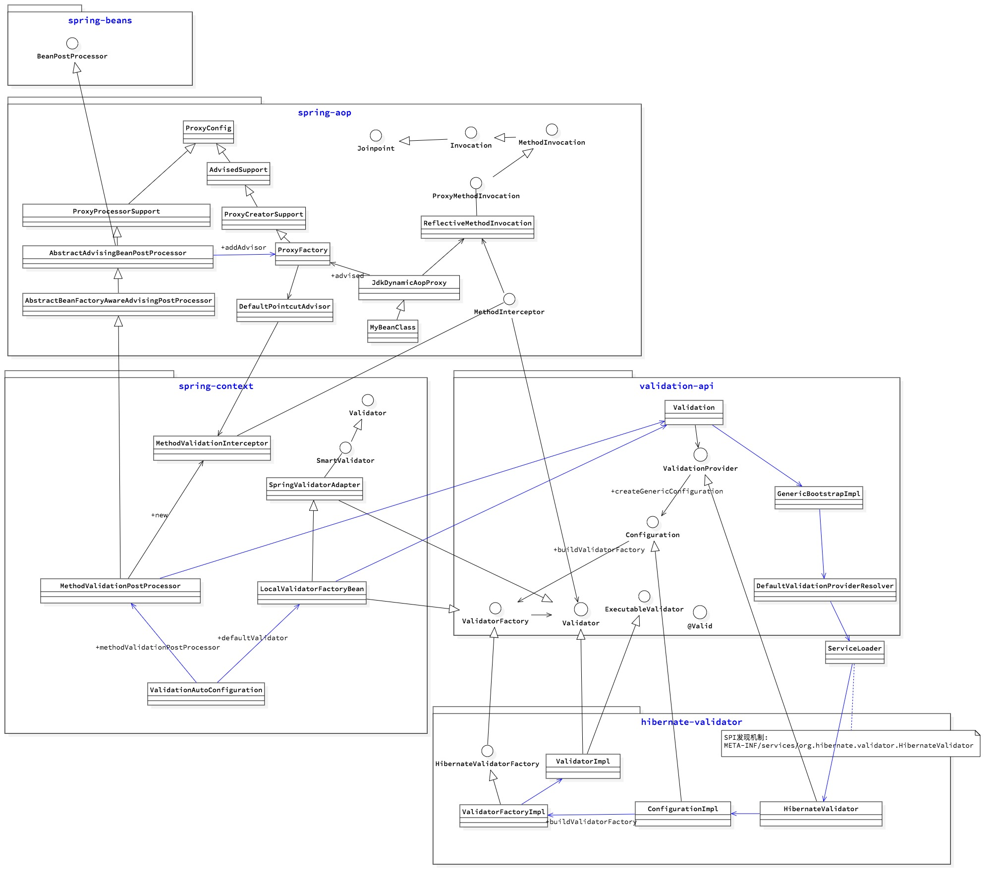

# 使用

### step1: pom文件引入jar包，

<font color=red> 特别注意：非web应用要加javax.el这个jar包，hibernate-validator生成错误消息的时候要用到el表达式处理，如果不加可能会报错找不到ELManager。
</font>

(https://docs.jboss.org/hibernate/stable/validator/reference/en-US/html_single/#validator-gettingstarted-uel)

```
<dependency>
    <groupId>org.hibernate.validator</groupId>
    <artifactId>hibernate-validator</artifactId>
    <version>6.0.17.Final</version>
</dependency>
<dependency>
    <groupId>org.glassfish</groupId>
    <artifactId>javax.el</artifactId>
    <version>3.0.1-b09</version>
</dependency>
```

### step2: api层使用javax.validation.constraints校验注解
常用的有：  @NotNull,  @Size, @Pattern, @Max, @Min


### step3: service层
service impl上加@Validated告诉spring拦截器这个类要做验证 .
model上加@Valid表示要做级联验证validation cascading.
<font color=red>
使用hibernate validation 2的时候，不要让框架自己抛出ConstraintViolationException，
否则客户端用的是hibernate 1 的话，反序列化时，ConstraintViolationException类不兼容，会有问题.
我现在是手动校验抛出 ```IllegalArguementException ```，这个是jdk的通用类，不会有兼容问题。
</font>


```
@Component
public class XXServiceImpl implements XXService {

    @Override
    public Long open(Param param) {
        //手工校验
        validationTool.validateParam(param);
        //业务代码。。。
    }
}
```

```

import java.util.Set;
import java.util.stream.Collectors;

import javax.validation.ConstraintViolation;
import javax.validation.Validator;

import org.springframework.beans.factory.annotation.Autowired;
import org.springframework.stereotype.Component;


@Component
public class ValidationTool {

    @Autowired
    private Validator validator;

    /**
     * 校验参数，将校验不通过的错误信息转换为IllegalArgumentException抛出来，避免ConstraintViolationException序列化问题。
     *
     * @param param parameter to validate
     * @param <T>   type of parameter
     */
    public <T> void validateParam(T param) {
        Set<ConstraintViolation<T>> violations = validator.validate(param);
        if (violations.size() > 0) {
            String message = violations.stream().map(ConstraintViolation::getMessage).collect(Collectors.joining(";"));
            throw new IllegalArgumentException(message);
        }
    }
}
```

### step4: 写个test试试效果：
```
@RunWith(SpringRunner.class)
@SpringBootTest(classes = Application.class)
@ActiveProfiles("dev")
public class IntegrationTest {
    @Autowired
    private SalesmanReadService salesmanReadService;

    @Test
    //@Test(expected = ConstraintViolationException.class)
    public void getOrgUserIdNull() {
        Long orgUserId = salesmanReadService.getOrgUserId(null, SalesmanRole.SALESMAN);
    }
}
```

可以看到MethodValidationInterceptor对方法做了拦截和校验，
打开注释@Test(expected = ConstraintViolationException.class)可以通过测试。


# 原理

- 利用java ServiceLoader的 [SPI 发现加载机制](URL 'https://docs.oracle.com/javase/tutorial/ext/basics/spi.html') ，将validation-api与实现(hibernate-validator, fastvalidator)分离。

- 利用Spring JdkDynamicAopProxy代理机制，实现方法拦截。

- 利用Spring IoC容器提供的扩展点（[BeanPostProcessor](URL 'https://docs.spring.io/spring/docs/current/spring-framework-reference/core.html#beans-factory-extension-bpp'), InitializingBean），先初始化拦截器MethodValidationInterceptor，然后植入到业务Bean的代理中。

- 利用Spring Boot的auto configuration自动装配机制，自动创建MethodValidationPostProcessor和LocalValidatorFactoryBean：
前者用来生成和植入拦截器MethodValidationInterceptor，调用方法时自动拦截；
后者生成Validator，这样我们通过autowire即可获得Validator，手工调用。


不过有时候autoconfig由于一些原因没起作用，我们可以手工来设置validator
```Java
@Configuration
public class CommonConfig {
    @Bean
    public Validator validator() {
        //org.hibernate.validator.internal.engine.ValidatorImpl
        return Validation.byProvider(HibernateValidator.class)
            .configure()
            .buildValidatorFactory()
            .getValidator();
    }

}

```

# 类图



# 初始化拦截器和Bean
基于spring boot autoconfig机制，从ValidationAutoConfiguration开始初始化：
- 生成validator的工厂bean: LocalValidatorFactoryBean
- 生成方法拦截切面，并注入对validator的引用: MethodValidationPostProcessor


# 调用方法自动拦截进行校验


# 避坑指南

## 引入fast-validator会导致hibernate-validator验证失效：

原因：validation-api中的Validation， 是用SPI机制发现和加载ValidationProvider实现类的：
ServiceLoader.load( ValidationProvider.class, classloader )

由于引入了两个jar包（fast-validator, hibernate-validator） 提供了2个ValidationProvider实现，那么按Validation默认逻辑，只会get(0)获取第一个。


- 解法1：去掉一个包，避免引入多个validator实现类（比如hibernate-validator，fast-validator）。

- 解法2：手工指定ValidationProvider实现类
```Java
@Configuration
public class CommonConfig {
    @Bean
    public Validator validator() {
        return Validation.byProvider(HibernateValidator.class)
            .configure()
            .buildValidatorFactory()
            .getValidator();
    }

}
```